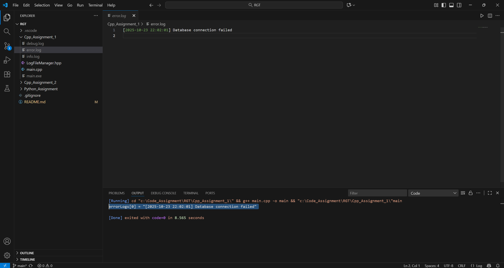
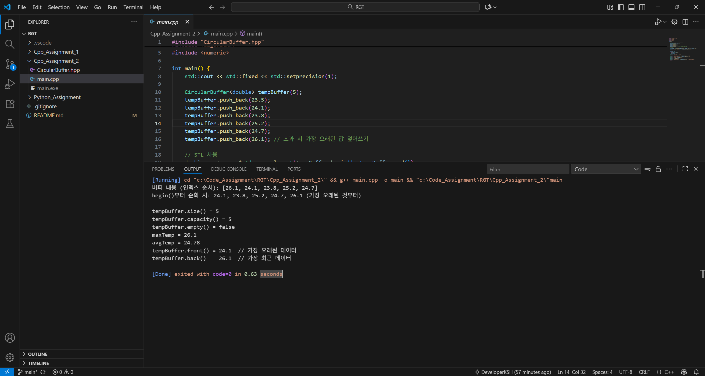
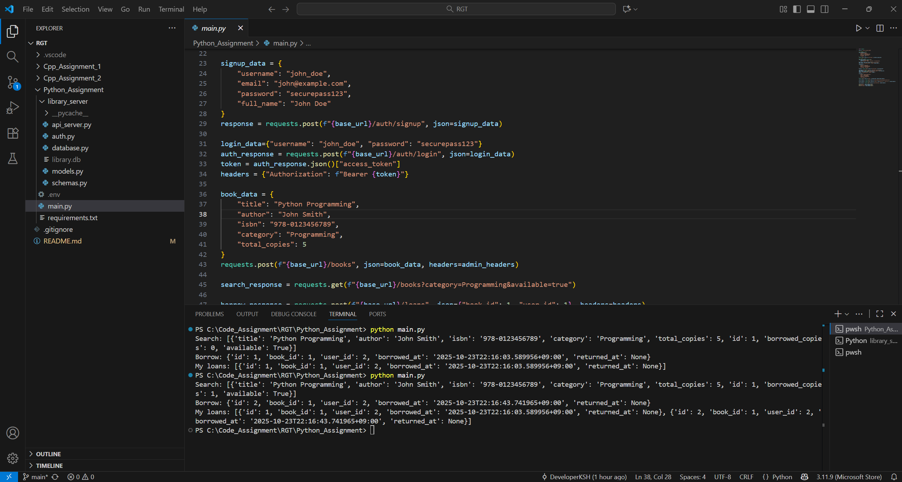

# RGT_Coding_Assignment

총 3개의 과제를 진행했고, 각 과제에 대해 **간단 설명**과 **실행 결과(스크린샷/동영상)** 를 한 문서에 정리했습니다.

- [C++ 과제 1 — 스마트 포인터 기반 LogFileManager](#c-과제-1--스마트-포인터-기반-logfilemanager)
- [C++ 과제 2 — 템플릿 원형 버퍼 CircularBuffer](#c-과제-2--템플릿-원형-버퍼-circularbuffer)
- [Python 과제 — FastAPI 기반 도서관 RESTful API](#python-과제--fastapi-기반-도서관-restful-api)

---

## C++ 과제 1 — 스마트 포인터 기반 LogFileManager

### 과제 설명
- 여러 로그 파일을 **동시에 관리**하고, 각 파일에 **타임스탬프**와 함께 로그를 기록하는 `LogFileManager` 구현
- 핵심 요구사항
  - `LogFileManager` 클래스 정의 (`public`/`private`접근 제한자 명시)
  - 적절한 스마트 포인터로 파일 핸들 관리
  - 메서드: `openLogFile`, `writeLog`, `readLogs`, `closeLogFile`
  - 복사/이동 생성자 및 대입 연산자 적절히 처리
  - 예외 안전성 보장 (파일 열기 실패, 쓰기 실패 등)

### 실행 결과
**스크린샷**

---

## C++ 과제 2 — 템플릿 원형 버퍼 CircularBuffer

### 과제 설명
- 센서 데이터 스트림을 **효율적으로 저장 및 처리**하는 **고정 크기 원형 버퍼**인 `CircularBuffer` 구현
- 핵심 요구사항
  - `CircularBuffer` 템플릿 클래스 정의
  - `CircularBuffer` 생성자 구현
  - STL 호환 forward iterator 구현
  - 메서드: `begin`, `end`, `size`, `capacity`, `empty`
  - 메서드: `push_back`, `pop_front`, `front`, `back`
  - const와 non-const 버전 메서드 제공
  - 범위 기반 for문 지원

### 실행 결과
**스크린샷**

---

## Python 과제 — FastAPI 기반 도서관 RESTful API

### 과제 설명
- 사용자 인증, 도서 관리, 대출/반납 기능을 제공하는 **온라인 도서관 관리 시스템**의 **RESTful API 서버**를 구현
- 핵심 요구사항
  - API 엔트포인트 구현: POST, GET, DELETE
  - 데이터베이스 모델
  - 인증/인가 시스템
  - 데이터 검증
  - 환경설정

### 실행 결과
**스크린샷**

